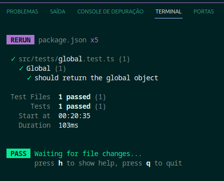
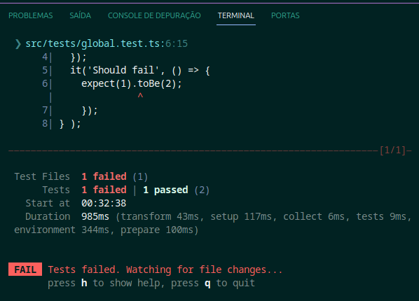
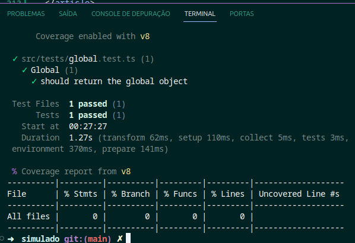

# Desafio React

### Descrição

O desafio proposto ao final do módulo de front-end no curso full stack da Trybe foi realizado para demonstrar e testar os conhecimentos adquiridos durante o curso. Consiste na criação de um aplicativo web para exibir notícias utilizando a API do IBGE na versão 3, lançada em 05/06/2017.

O aplicativo tem como objetivo mostrar as notícias mais recentes do IBGE, exibindo a data de publicação relativa ao momento atual, bem como um link para a notícia completa. Além disso, deve permitir a marcação de notícias como favoritas, filtragem de notícias e ser responsivo.

O desenvolvimento do aplicativo é realizado com React, seguindo as boas práticas de desenvolvimento e semântica HTML.

Embora os testes unitários e o deploy sejam opcionais, serão considerados como diferenciais. A cobertura de testes esperada é de, no mínimo, 50%.

O app foi hospedado nesse link: <a>https://desafioreact.netlify.app/</a>

### Desenvolvimento

#### Ferramentas Utilizadas

**Front-end**: React, Vite, Vitest, TypeScript, React Router, React-Redux, Redux DevTools e React Testing Library.
**Estilização**: CSS puro e styled-components.  
**Persistência de Dados**: Local Storage.
**Testes Unitários**: React Testing Library e Vitest.

#### Escolha das Tecnologias

**Redux**: Utilizado para o gerenciamento do estado global da aplicação. Não foi necessário implementar o redux-thunk. Optei pelo Redux em vez do Context API devido à sua clareza e precisão.

**React Router**: Optei pelo React Router para gerenciar as rotas da aplicação. Possuo familiaridade com essa ferramenta, tornando-a a escolha mais natural para a criação das rotas necessárias.

**Local Storage**: Utilizei o Local Storage para a persistência de dados devido à restrição do desafio que proibia o uso de banco de dados. Atualmente, estou ingressando na área de backend e ainda não possuo conhecimento em bancos de dados como MySQL, PostgreSQL, MongoDB, entre outros.

**React Testing Library**: Escolhi a React Testing Library para os testes unitários, visto que é a biblioteca com a qual tenho maior familiaridade e experiência.

**Vite**: Optei pelo Vite para o desenvolvimento, uma vez que é mais ágil do que o webpack. Durante todo o módulo de front-end do curso, utilizei essa ferramenta, o que contribuiu para a familiaridade e agilidade no desenvolvimento do projeto.

**Styled-Components**: Utilizei o styled-components para a estilização. Esta biblioteca é a que possuo maior familiaridade, facilitando a manipulação de estilos no React. Acredito que seja mais fácil de usar, manter o código e evite conflitos de classes.
### Versões das Dependências

- React: 18.2.0
- React Router: 6.18.0
- React Redux: 8.1.3
- Redux Devtools: 3.2.6
- React Testing Library: 14.1.2
- Vitest: 0.34.6
- Vite: 4.4.5
- TypeScript: 5.0.2
- Styled Components: 6.1.1

### Histórico e Fluxo de Trabalho do Git

#### Fluxo de Trabalho Simplificado

Desenvolvi este projeto de forma individual, o que simplificou o fluxo de controle de versão. Optei por uma abordagem direta, utilizando principalmente a branch main para todo o desenvolvimento.

#### Uso Básico dos Comandos do Git

Devido à natureza individual deste projeto, utilizei os comandos básicos do Git para controlar o versionamento. Os comandos `git add`, `git commit`, e `git push` foram essenciais para adicionar, registrar e enviar as alterações para o repositório remoto. Essa metodologia permitiu um controle detalhado das mudanças realizadas em cada etapa do desenvolvimento.

#### Organização do Versionamento

Para manter a organização do versionamento, fiz commits frequentes para documentar as alterações realizadas. Cada commit foi utilizado para agrupar um conjunto de mudanças coesas, com mensagens claras e descritivas que facilitaram a compreensão das alterações realizadas.

#### Referência à Branch 'main'

Todo o desenvolvimento do projeto foi realizado diretamente na branch main. Por trabalhar individualmente, não foi necessário criar outras branches para separar funcionalidades ou correções, mantendo o código principal sempre atualizado.

### Funcionamento dos Componentes

#### Home

- **Página Inicial**: Mostra as notícias e permite filtrar por categoria.
- **Cards de Notícia**: Exibem detalhes como título, introdução e uma imagem.
- **Leitura Completa**: Ao clicar em "Ler Mais", redireciona para o site do IBGE com a notícia completa.
- **Filtros**: Disponíveis para ordenar por favoritos, marcados, todos e por data/hora de publicação. Os cards que não se encaixam no filtro são ocultados, gerando páginas com diferentes quantidades de cards.
- **Paginação Dinâmica**: Se o filtro resultar em poucos ou nenhum card na primeira página, a navegação para a próxima página exibe mais cards correspondentes ao filtro. Ao navegar pelas páginas verá mais card sobre referentes ao filtro aplicado. 
Obs: Isso não se aplica aos filtros de marcação e favoritos. Eles sempre retornará todos os itens respeitando o limite de 15 itens por página.

#### Rodapé

- **Navegação e Filtros**: Mostra três botões para voltar à página anterior, abrir um menu com mais filtros e ir para a próxima página.

#### Header

- **Informações do Usuário**: Exibe nome e foto do usuário logado.
- **Menu de Opções**: Oferece acesso ao perfil, input de pesquisa e botões de login, logout, about e contato.
- **Pesquisa de Notícias**: Permite pesquisar notícias, embora possa haver um problema persistente de retorno repetido de notícias. Não consegui resolver esse problema.

#### Cadastro de Usuário

- **Persistência de Dados**: Utiliza Local Storage para armazenar dados do usuário.
- **Campos de Cadastro**: Nome, e-mail, senha, endereço e opção de foto.
- **Armazenamento e Alteração de Dados**: Os dados são salvos no Local Storage e podem ser modificados na página de perfil.

#### Login

- **Persistência de Estado**: Usa Local Storage para manter o estado conectado do usuário na chave 'connected'. Esse estado é requirido para verificação ao acessar o perfil e página de login.
- **Validação de Dados**: Requer dados do localstorage na chave 'users' para validar e-mail e senha para login.
- **Alertas de Login**: Notificações caso o usuário não esteja cadastrado ou caso já esteja logado.

#### Perfil

- **Detalhes do Usuário**: Mostra todos os dados do usuário cadastrado.
- **Edição de Dados**: Permite alterar informações do usuário de forma individual ou coletiva.

## Para montar localmente

### Dependências

Para montar o projeto localmente, é necessário ter o NodeJS instalado. Ter feito o clone do repositório e ter instalado as dependências do projeto.

#### Clone

Para clonar o repositório, basta rodar o comando git clone com a chave ssh 
`git clone git@github.com:jorgejesuscardoso/Desafio_React.git`

Para instalar as dependências do projeto, basta rodar o comando `npm install` ou `yarn install`.

Primeiro abra seu terminal e navegue até a pasta onde deseja clonar o repositório. Se tiver usando linux basta clicar com o botão direito do mouse na pasta e selecionar a opção 'Abrir no terminal'.   
Se estiver usando windows, basta abrir o terminal e navegar até a pasta onde deseja clonar o repositório. Então digite o comando git clone. 

Apois isso, todos os arquivos será clonados para a pasta selecionada. Então navegue até a pasta do projeto e abra o terminal. Então digite o comando `npm install` ou `yarn install` para instalar as dependências do projeto.

Apos instalar as dependências, basta rodar o comando `npm run dev` ou `yarn dev` para executar o projeto. O navegador será aberto automaticamente. Se não abrir, basta abrir o navegador e digitar `localhost:3000` na barra de endereço. É essencial que tenha o NodeJS instalado e tenha configurado corretamente o git.

Para instalar o NodeJS, basta acessar o site oficial do NodeJS e baixar a versão LTS.

#### Testes

Para executar os testes, basta rodar o comando 'npm run test' ou 'yarn test'.

Apos executar o comando, será exibido no terminarl os resultados dos testes.

Para executar os testes com cobertura, basta rodar o comando `npm run test` ou `yarn test`. Para cobertura, `npm run coverage` ou `yarn run coverage`. Apos executar o comando, será exibido no terminarl os resultados dos testes e/ou cobertura dos respectivos arquivos e suas funções, linhas e branches.

Exemplo `npm run test`:  Teste bem sucedido

Exemplo `npm run test`:  
Houve um teste com falha

Exemplo `npm run coverage`:  
Teste de cobertura

#### Build
Para fazer o build do projeto, basta rodar o comando `npm run build` ou `yarn build`.
Apos executar o comando, será criada uma pasta chamada 'dist' com os arquivos necessários para o deploy.

## Agradecimentos Especiais

Gostaria de agradecer ao ChatGPT pela ajuda na revisão da documentação deste projeto. Além de tirar muitas duvidas que sugiram durante o desenvolvimento. Suas contribuições foram valiosas durante o desenvolvimento do projeto e na qualidade e clareza das informações apresentadas neste README.

## Considerações Finais

Obrigado por dedicar seu tempo até aqui! Espero que tenha apreciado o projeto tanto quanto eu gostei de desenvolvê-lo. Ele foi construído com muito carinho e empenho.

Este desafio foi uma experiência desafiadora e ao mesmo tempo empolgante, proporcionando aprendizados valiosos ao longo do processo de desenvolvimento.

Caso tenha alguma dúvida, sugestão ou crítica construtiva, ficarei feliz em receber seu feedback. Sinta-se à vontade para entrar em contato comigo pelo e-mail tst.jorgecardoso@gmail.com.

Obrigado novamente pela oportunidade e interesse no projeto!
